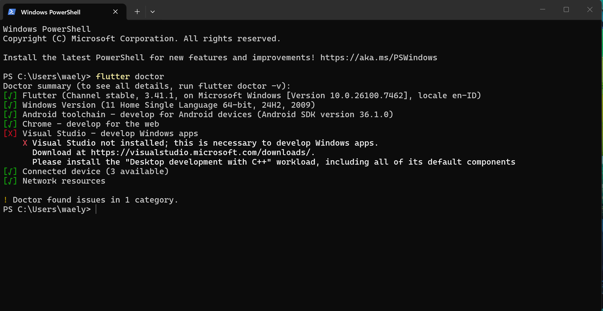

# Laporan Praktikum #01 - Pengantar Pemrograman Mobile

## Identitas Mahasiswa

| Atribut | Nilai                        |
| ------- | -----                        |
| Nama    | Nur Waely Qistina            |
| NIM     | 244107060011                 |
| Kelas   | SIB-2D                       |

---

## Tugas Praktikum 1

### Hasil Flutter Doctor

Berikut adalah hasil dari perintah `flutter doctor` yang menunjukkan bahwa semua komponen telah terinstal dan terkonfigurasi dengan baik:

