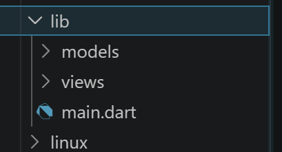
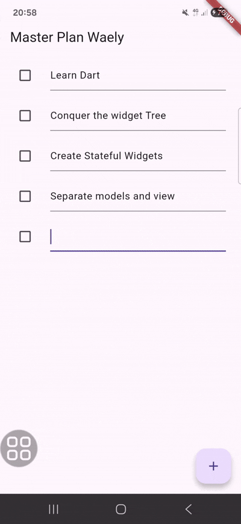
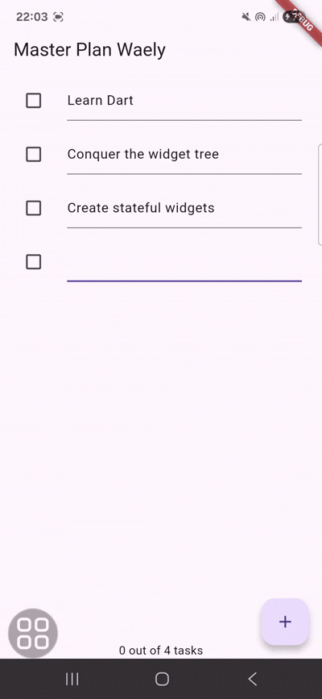
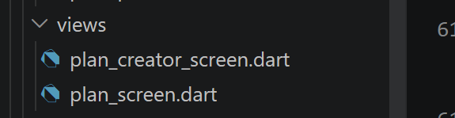
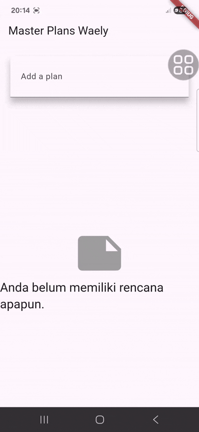
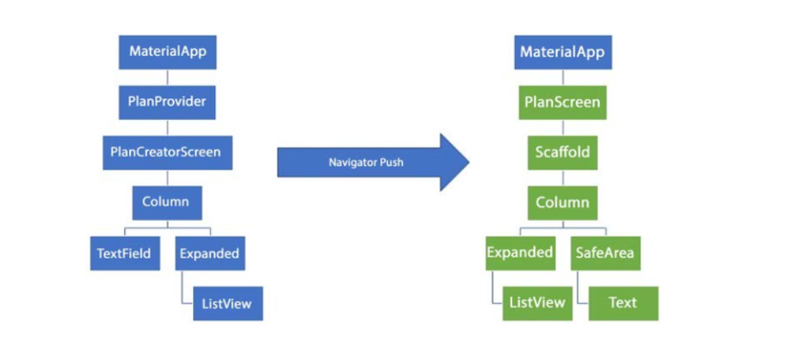

# Laporan Praktikum 10: Dasar State Management

Nama: Nur Waely Qistina

NIM: 244107060011

Kelas: SIB 2D

# Praktikum 1: Dasar State dengan Model-View

## Langkah 1: Buat Project Baru

Buatlah sebuah project flutter baru dengan nama master_plan di folder src week-10 repository GitHub Anda atau sesuai style laporan praktikum yang telah disepakati. Lalu buatlah susunan folder dalam project seperti gambar berikut ini.



## Langkah 2: Membuat model task.dart

```
class Task {
  final String description;
  final bool complete;

  const Task({this.complete = false, this.description = ''});
}

```

## Langkah 3: Buat file plan.dart

```
import './task.dart';

class Plan {
  final String name;
  final List<Task> tasks;

  const Plan({this.name = '', this.tasks = const []});
}

```

## Langkah 4: Buat file data_layer.dart

```
export 'plan.dart';
export 'task.dart';

```

## Langkah 5: Pindah ke file main.dart

```
import 'package:flutter/material.dart';
import './views/plan_screen.dart';

void main() => runApp(MasterPlanApp());

class MasterPlanApp extends StatelessWidget {
  const MasterPlanApp({super.key});

  @override
  Widget build(BuildContext context) {
    return MaterialApp(
      theme: ThemeData(primarySwatch: Colors.purple),
      home: PlanScreen(),
    );
  }
}

```

## Langkah 6: buat plan_screen.dart

```
import '../models/data_layer.dart';
import 'package:flutter/material.dart';

class PlanScreen extends StatefulWidget {
  const PlanScreen({super.key});

  @override
  State createState() => _PlanScreenState();
}

class _PlanScreenState extends State<PlanScreen> {
  Plan plan = const Plan();

  @override
  Widget build(BuildContext context) {
    return Scaffold(
      // ganti ‘Namaku' dengan Nama panggilan Anda
      appBar: AppBar(title: const Text('Master Plan Waely')),
      body: _buildList(),
      floatingActionButton: _buildAddTaskButton(),
    );
  }
```

## Langkah 7: buat method \_buildAddTaskButton()

```
 Widget _buildAddTaskButton() {
    return FloatingActionButton(
      child: const Icon(Icons.add),
      onPressed: () {
        setState(() {
          plan = Plan(
            name: plan.name,
            tasks: List<Task>.from(plan.tasks)..add(const Task()),
          );
        });
      },
    );
  }
```

## Langkah 8: buat widget \_buildList()

```
Widget _buildList() {
    return ListView.builder(
      itemCount: plan.tasks.length,
      itemBuilder: (context, index) => _buildTaskTile(plan.tasks[index], index),
    );
  }

```

## Langkah 9: buat widget \_buildTaskTile

```
Widget _buildTaskTile(Task task, int index) {
    return ListTile(
      leading: Checkbox(
        value: task.complete,
        onChanged: (selected) {
          setState(() {
            plan = Plan(
              name: plan.name,
              tasks: List<Task>.from(plan.tasks)
                ..[index] = Task(
                  description: task.description,
                  complete: selected ?? false,
                ),
            );
          });
        },
      ),
      title: TextFormField(
        initialValue: task.description,
        onChanged: (text) {
          setState(() {
            plan = Plan(
              name: plan.name,
              tasks: List<Task>.from(plan.tasks)
                ..[index] = Task(description: text, complete: task.complete),
            );
          });
        },
      ),
    );
  }
```

## Langkah 10: Tambah Scroll Controller

```
late ScrollController scrollController;

```

## Langkah 11: Tambah Scroll Listener

```
@override
  void initState() {
    super.initState();
    scrollController = ScrollController()
      ..addListener(() {
        FocusScope.of(context).requestFocus(FocusNode());
      });
  }

```

## Langkah 12: Tambah controller dan keyboard behavior

```

  Widget _buildList() {
    return ListView.builder(
      controller: scrollController,
      keyboardDismissBehavior: Theme.of(context).platform == TargetPlatform.iOS
          ? ScrollViewKeyboardDismissBehavior.onDrag
          : ScrollViewKeyboardDismissBehavior.manual,
      itemCount: plan.tasks.length,
      itemBuilder: (context, index) => _buildTaskTile(plan.tasks[index], index),
    );
  }

```

## Langkah 13: Terakhir, tambah method dispose()

```
  @override
  void dispose() {
    scrollController.dispose();
    super.dispose();
  }
```

## Langkah 14: Hasil



# Tugas Praktikum 1: Dasar State dengan Model-View

### 1. Selesaikan langkah-langkah praktikum tersebut, lalu dokumentasikan berupa GIF hasil akhir praktikum beserta penjelasannya di file README.md! Jika Anda menemukan ada yang error atau tidak berjalan dengan baik, silakan diperbaiki.

### 2. Jelaskan maksud dari langkah 4 pada praktikum tersebut! Mengapa dilakukan demikian?

Langkah 4 dilakukan untuk membuat file data_layer.dart sebagai penggabung (barrel file) dari beberapa file model seperti plan.dart dan task.dart. Tujuannya agar saat menggunakan model di file lain, kita cukup mengimpor satu file saja, yaitu data_layer.dart, tanpa perlu mengimpor setiap file satu per satu.

### 3. Mengapa perlu variabel plan di langkah 6 pada praktikum tersebut? Mengapa dibuat konstanta ?

Variabel plan pada langkah 6 digunakan untuk menyimpan data utama aplikasi berupa objek Plan yang berisi nama rencana dan daftar tugas. Data ini dapat berubah, seperti saat menambah atau mengubah tugas, lalu diperbarui menggunakan setState(). Awalnya, plan diisi dengan const Plan() sebagai nilai default yang tetap dan lebih hemat memori.

### 4. Lakukan capture hasil dari Langkah 9 berupa GIF, kemudian jelaskan apa yang telah Anda buat!

Pada langkah 9 dibuat widget \_buildTaskTile() untuk menampilkan tugas dalam bentuk ListTile. Widget ini menampilkan Checkbox untuk checklist dan TextFormField untuk mengedit tugas. Setiap perubahan diperbarui dengan setState() sehingga tampilan berubah secara real-time. Hasil percobaan menunjukkan aplikasi sudah dapat menambah, mengedit, dan memberi checklist tugas tanpa perlu refresh.

### 5. Apa kegunaan method pada Langkah 11 dan 13 dalam lifecyle state ?

Pada langkah 11, initState() digunakan untuk inisialisasi awal saat State pertama kali dibuat. Di sini, ScrollController dibuat dan diberi listener untuk menghilangkan fokus dari TextField saat pengguna melakukan scroll, sehingga keyboard otomatis tertutup. Pada langkah 13, dispose() digunakan saat widget sudah tidak dipakai lagi, method ini berfungsi untuk membersihkan ScrollController.

### 6. Kumpulkan laporan praktikum Anda berupa link commit atau repository GitHub ke dosen yang telah disepakati !

# Praktikum 2: Mengelola Data Layer dengan InheritedWidget dan InheritedNotifier

## Langkah 1: Buat file plan_provider.dart

Buat folder baru provider di dalam folder lib, lalu buat file baru dengan nama plan_provider.dart berisi kode seperti berikut.

```
import 'package:flutter/material.dart';
import '../models/data_layer.dart';

class PlanProvider extends InheritedNotifier<ValueNotifier<Plan>> {
  const PlanProvider({
    super.key,
    required Widget child,
    required ValueNotifier<Plan> notifier,
  }) : super(child: child, notifier: notifier);

  static ValueNotifier<Plan> of(BuildContext context) {
    return context
        .dependOnInheritedWidgetOfExactType<PlanProvider>()!
        .notifier!;
  }
}

```

## Langkah 2: Edit main.dart

Gantilah pada bagian atribut home dengan PlanProvider seperti berikut. Jangan lupa sesuaikan bagian impor jika dibutuhkan.

```
import 'package:flutter/material.dart';
import './views/plan_screen.dart';
import './provider/plan_provider.dart';
import './models/data_layer.dart';

void main() => runApp(const MasterPlanApp());

class MasterPlanApp extends StatelessWidget {
  const MasterPlanApp({super.key});

  @override
  Widget build(BuildContext context) {
    return MaterialApp(
      theme: ThemeData(primarySwatch: Colors.purple),
      home: PlanProvider(
        notifier: ValueNotifier<Plan>(const Plan()),
        child: const PlanScreen(),
      ),
    );
  }
}

```

## Langkah 3: Tambah method pada model plan.dart

Tambahkan dua method di dalam model class Plan seperti kode berikut.

```
import './task.dart';

class Plan {
  final String name;
  final List<Task> tasks;

  const Plan({this.name = '', this.tasks = const []});
  int get completedCount => tasks.where((task) => task.complete).length;

  String get completenessMessage =>
      '$completedCount out of ${tasks.length} tasks';
}

```

## Langkah 4: Pindah ke PlanScreen

Edit PlanScreen agar menggunakan data dari PlanProvider. Hapus deklarasi variabel plan (ini akan membuat error). Kita akan perbaiki pada langkah 5 berikut ini.

- Menghapus

```
Plan plan = const Plan();
```

## Langkah 5: Edit method \_buildAddTaskButton

Tambahkan BuildContext sebagai parameter dan gunakan PlanProvider sebagai sumber datanya. Edit bagian kode seperti berikut.

```
  Widget _buildAddTaskButton(BuildContext context) {
    ValueNotifier<Plan> planNotifier = PlanProvider.of(context);
    return FloatingActionButton(
      child: const Icon(Icons.add),
      onPressed: () {
        Plan currentPlan = planNotifier.value;
        planNotifier.value = Plan(
          name: currentPlan.name,
          tasks: List<Task>.from(currentPlan.tasks)..add(const Task()),
        );
      },
    );
  }

```

## Langkah 6: Edit method \_buildTaskTile

Tambahkan parameter BuildContext, gunakan PlanProvider sebagai sumber data. Ganti TextField menjadi TextFormField untuk membuat inisial data provider menjadi lebih mudah.

```
Widget _buildTaskTile(Task task, int index, BuildContext context) {
    ValueNotifier<Plan> planNotifier = PlanProvider.of(context);
    return ListTile(
      leading: Checkbox(
        value: task.complete,
        onChanged: (selected) {
          Plan currentPlan = planNotifier.value;
          planNotifier.value = Plan(
            name: currentPlan.name,
            tasks: List<Task>.from(currentPlan.tasks)
              ..[index] = Task(
                description: task.description,
                complete: selected ?? false,
              ),
          );
        },
      ),
      title: TextFormField(
        initialValue: task.description,
        onChanged: (text) {
          Plan currentPlan = planNotifier.value;
          planNotifier.value = Plan(
            name: currentPlan.name,
            tasks: List<Task>.from(currentPlan.tasks)
              ..[index] = Task(description: text, complete: task.complete),
          );
        },
      ),
    );
  }

```

## Langkah 7: Edit \_buildList

Sesuaikan parameter pada bagian \_buildTaskTile seperti kode berikut.

```
  Widget _buildList(Plan plan) {
    return ListView.builder(
      controller: scrollController,
      itemCount: plan.tasks.length,
      itemBuilder: (context, index) =>
          _buildTaskTile(plan.tasks[index], index, context),
    );
  }

```

## Langkah 8: Tetap di class PlanScreen

Edit method build sehingga bisa tampil progress pada bagian bawah (footer). Caranya, bungkus (wrap) \_buildList dengan widget Expanded dan masukkan ke dalam widget Column seperti kode pada Langkah 9.

## Langkah 9: Tambah widget SafeArea

Terakhir, tambahkan widget SafeArea dengan berisi completenessMessage pada akhir widget Column. Perhatikan kode berikut ini.

```
  @override
  Widget build(BuildContext context) {
    return Scaffold(
      appBar: AppBar(title: const Text('Master Plan Waely')),
      body: ValueListenableBuilder<Plan>(
        valueListenable: PlanProvider.of(context),
        builder: (context, plan, child) {
          return Column(
            children: [
              Expanded(child: _buildList(plan)),
              SafeArea(child: Text(plan.completenessMessage)),
            ],
          );
        },
      ),
      floatingActionButton: _buildAddTaskButton(context),
    );
  }

```

## Output



# Tugas Praktikum 2: InheritedWidget

### 1. Selesaikan langkah-langkah praktikum tersebut, lalu dokumentasikan berupa GIF hasil akhir praktikum beserta penjelasannya di file README.md! Jika Anda menemukan ada yang error atau tidak berjalan dengan baik, silakan diperbaiki sesuai dengan tujuan aplikasi tersebut dibuat.

### 2. Jelaskan mana yang dimaksud InheritedWidget pada langkah 1 tersebut! Mengapa yang digunakan InheritedNotifier?

Pada langkah 1, yang dimaksud sebagai InheritedWidget adalah class berikut:

```
class PlanProvider extends InheritedNotifier<ValueNotifier<Plan>>
```

PlanProvider menggunakan InheritedNotifier untuk membagikan data Plan ke semua widget turunan dengan lebih mudah dan efisien. InheritedNotifier dipilih karena dapat mendeteksi perubahan pada ValueNotifier<Plan> secara otomatis, sehingga tampilan aplikasi akan langsung diperbarui tanpa perlu menggunakan setState().

### 3. Jelaskan maksud dari method di langkah 3 pada praktikum tersebut! Mengapa dilakukan demikian?

Method completedCount dan completenessMessage pada class Plan digunakan untuk menghitung jumlah tugas yang sudah selesai dan menampilkan progres tugas secara otomatis. Method ini dibuat di dalam model agar proses pengolahan data terpisah dari tampilan (UI), sehingga kode menjadi lebih rapi.

### 4. Lakukan capture hasil dari Langkah 9 berupa GIF, kemudian jelaskan apa yang telah Anda buat!

Berdasarkan praktikum langkah 1–9, dibuat aplikasi Master Plan dengan state management menggunakan InheritedNotifier dan ValueNotifier melalui PlanProvider. Pengguna dapat menambah tugas dengan FloatingActionButton, mengedit tugas dengan TextFormField, dan menandai tugas selesai menggunakan Checkbox. Perubahan data langsung muncul di tampilan tanpa setState(), karena data dikelola di PlanProvider. Aplikasi juga menampilkan progres tugas di bagian bawah (footer) berupa jumlah tugas selesai dan total tugas dari completenessMessage pada model Plan.

### 5. Kumpulkan laporan praktikum Anda berupa link commit atau repository GitHub ke dosen yang telah disepakati !

# Praktikum 3: Membuat State di Multiple Screens

## Langkah 1: Edit PlanProvider

```
class PlanProvider extends InheritedNotifier<ValueNotifier<List<Plan>>> {
  const PlanProvider({
    super.key,
    required Widget child,
    required ValueNotifier<List<Plan>> notifier,
  }) : super(child: child, notifier: notifier);

  static ValueNotifier<List<Plan>> of(BuildContext context) {
    return context
        .dependOnInheritedWidgetOfExactType<PlanProvider>()!
        .notifier!;
  }
}

```

## Langkah 2: Edit main.dart

Langkah sebelumnya dapat menyebabkan error pada main.dart dan plan_screen.dart. Pada method build, gantilah menjadi kode seperti ini.

```
  @override
  Widget build(BuildContext context) {
    return PlanProvider(
      notifier: ValueNotifier<List<Plan>>(const []),
      child: MaterialApp(
        title: 'State management app',
        theme: ThemeData(primarySwatch: Colors.blue),
        home: const PlanScreen(),
      ),
    );
  }
}
```

## Langkah 3: Edit plan_screen.dart

```
class PlanScreen extends StatefulWidget {
  final Plan plan;
  const PlanScreen({super.key, required this.plan});
}

```

## Langkah 4: Error

Itu akan terjadi error setiap kali memanggil PlanProvider.of(context). Itu terjadi karena screen saat ini hanya menerima tugas-tugas untuk satu kelompok Plan, tapi sekarang PlanProvider menjadi list dari objek plan tersebut.

## Langkah 5: Tambah getter Plan

```
class _PlanScreenState extends State<PlanScreen> {
  // Plan plan = const Plan();

  late ScrollController scrollController;
  Plan get plan => widget.plan;
}

```

## Langkah 6: Method initState()

Pada bagian ini kode tetap seperti berikut.

```

@override
  void initState() {
    super.initState();
    scrollController = ScrollController()
      ..addListener(() {
        FocusScope.of(context).requestFocus(FocusNode());
      });
  }

```

## Langkah 7: Widget build

```

 @override
  Widget build(BuildContext context) {
    ValueNotifier<List<Plan>> plansNotifier = PlanProvider.of(context);

    return Scaffold(
      appBar: AppBar(title: const Text('Master Plan Waely')),
      body: ValueListenableBuilder<List<Plan>>(
        valueListenable: plansNotifier,
        builder: (context, plans, child) {
          Plan currentPlan = plans.first;

          return Column(
            children: [
              Expanded(child: _buildList(currentPlan)),
              SafeArea(child: Text(currentPlan.completenessMessage)),
            ],
          );
        },
      ),
      floatingActionButton: _buildAddTaskButton(context),
    );
  }

  Widget _buildAddTaskButton(BuildContext context) {
    ValueNotifier<List<Plan>> planNotifier = PlanProvider.of(context);

    return FloatingActionButton(
      child: const Icon(Icons.add),
      onPressed: () {
        List<Plan> currentPlans = planNotifier.value;

        Plan currentPlan = currentPlans.first;

        List<Task> updatedTasks = List<Task>.from(currentPlan.tasks)
          ..add(const Task());

        planNotifier.value = [
          Plan(name: currentPlan.name, tasks: updatedTasks),
        ];
      },
    );
  }

```

## Langkah 8: Edit \_buildTaskTile

```
Widget _buildTaskTile(Task task, int index, BuildContext context) {
    ValueNotifier<List<Plan>> planNotifier = PlanProvider.of(context);

    return ListTile(
      leading: Checkbox(
        value: task.complete,
        onChanged: (selected) {
          List<Plan> currentPlans = planNotifier.value;

          int planIndex = currentPlans.indexWhere(
            (p) => p.tasks.contains(task),
          );
          Plan currentPlan = currentPlans[planIndex];

          planNotifier.value = List<Plan>.from(currentPlans)
            ..[planIndex] = Plan(
              name: currentPlan.name,
              tasks: List<Task>.from(currentPlan.tasks)
                ..[index] = Task(
                  description: task.description,
                  complete: selected ?? false,
                ),
            );
        },
      ),
      title: TextFormField(
        initialValue: task.description,
        onChanged: (text) {
          List<Plan> currentPlans = planNotifier.value;

          int planIndex = currentPlans.indexWhere(
            (p) => p.tasks.contains(task),
          );
          Plan currentPlan = currentPlans[planIndex];

          planNotifier.value = List<Plan>.from(currentPlans)
            ..[planIndex] = Plan(
              name: currentPlan.name,
              tasks: List<Task>.from(currentPlan.tasks)
                ..[index] = Task(description: text, complete: task.complete),
            );
        },
      ),
    );
  }

```

## Langkah 9: Buat screen baru

Pada folder view, buatlah file baru dengan nama plan_creator_screen.dart dan deklarasikan dengan StatefulWidget bernama PlanCreatorScreen. Gantilah di main.dart pada atribut home menjadi seperti berikut.



```
 home: const PlanCreatorScreen(),
```

## Langkah 10: Pindah ke class \_PlanCreatorScreenState

```
class _PlanCreatorScreenState extends State<PlanCreatorScreen> {
  final textController = TextEditingController();
@override
void dispose() {
  textController.dispose();
  super.dispose();
}
}
```

## Langkah 11: Pindah ke method build

```
  @override
  Widget build(BuildContext context) {
    return Scaffold(
      appBar: AppBar(title: const Text('Master Plans Waely')),
      body: Column(
        children: [
          _buildListCreator(),
          Expanded(child: _buildMasterPlans()),
        ],
      ),
    );
  }
```

## Langkah 12: Buat widget \_buildListCreator

```
  Widget _buildListCreator() {
    return Padding(
      padding: const EdgeInsets.all(20.0),
      child: Material(
        color: Theme.of(context).cardColor,
        elevation: 10,
        child: TextField(
          controller: textController,
          decoration: const InputDecoration(
            labelText: 'Add a plan',
            contentPadding: EdgeInsets.all(20),
          ),
          onEditingComplete: addPlan,
        ),
      ),
    );
  }
```

## Langkah 13: Buat void addPlan()

```
void addPlan() {
    final text = textController.text;
    if (text.isEmpty) return;

    final plan = Plan(name: text, tasks: []);

    ValueNotifier<List<Plan>> planNotifier = PlanProvider.of(context);

    planNotifier.value = List<Plan>.from(planNotifier.value)..add(plan);

    textController.clear();
    FocusScope.of(context).requestFocus(FocusNode());
    setState(() {});
  }
```

## Langkah 14: Buat widget \_buildMasterPlans()

```
Widget _buildMasterPlans() {
    ValueNotifier<List<Plan>> planNotifier = PlanProvider.of(context);

    List<Plan> plans = planNotifier.value;

    if (plans.isEmpty) {
      return Column(
        mainAxisAlignment: MainAxisAlignment.center,
        children: <Widget>[
          const Icon(Icons.note, size: 100, color: Colors.grey),
          Text(
            'Anda belum memiliki rencana apapun.',
            style: Theme.of(context).textTheme.headlineSmall,
          ),
        ],
      );
    }

    return ListView.builder(
      itemCount: plans.length,
      itemBuilder: (context, index) {
        final plan = plans[index];

        return ListTile(
          title: Text(plan.name),
          subtitle: Text(plan.completenessMessage),
          onTap: () {
            Navigator.of(
              context,
            ).push(MaterialPageRoute(builder: (_) => PlanScreen(plan: plan)));
          },
        );
      },
    );
  }

```

## Output



# Tugas Praktikum 3: State di Multiple Screens

### 1. Selesaikan langkah-langkah praktikum tersebut, lalu dokumentasikan berupa GIF hasil akhir praktikum beserta penjelasannya di file README.md! Jika Anda menemukan ada yang error atau tidak berjalan dengan baik, silakan diperbaiki sesuai dengan tujuan aplikasi tersebut dibuat.

### 2. Berdasarkan Praktikum 3 yang telah Anda lakukan, jelaskan maksud dari gambar diagram berikut ini!



Diagram tersebut menunjukkan struktur aplikasi Flutter yang memakai PlanProvider.
PlanCreatorScreen digunakan untuk membuat dan menampilkan daftar plan, sedangkan PlanScreen menampilkan detail task dari plan yang dipilih. Perpindahan antar halaman dilakukan dengan Navigator.push, sehingga aplikasi bisa memiliki beberapa halaman (multi-screen) dengan data yang tetap tersimpan.

### 3. Lakukan capture hasil dari Langkah 14 berupa GIF, kemudian jelaskan apa yang telah Anda buat!

Pada langkah ini dibuat halaman untuk mengelola daftar plan. Pengguna dapat menambahkan plan baru melalui TextField, lalu data disimpan menggunakan PlanProvider dan ditampilkan dengan ListView.builder. Jika belum ada data, akan muncul pesan kosong. Pengguna juga bisa membuka detail plan pada halaman PlanScreen. Hasilnya, aplikasi sudah bisa menambah, menampilkan, dan membuka plan secara dinamis pada beberapa halaman.

### 4. Kumpulkan laporan praktikum Anda berupa link commit atau repository GitHub ke dosen yang telah disepakati !
