# Laporan Praktikum 11: Pemrograman Asynchronous

Nama: Nur Waely Qistina

NIM: 244107060011

Kelas: SIB 2D

# Praktikum 1: Mengunduh Data dari Web Service (API)

## Langkah 1: Buat Project Baru

Buatlah sebuah project flutter baru dengan nama books di folder src week-11 repository GitHub Anda.

Kemudian Tambahkan dependensi http dengan mengetik perintah berikut di terminal.

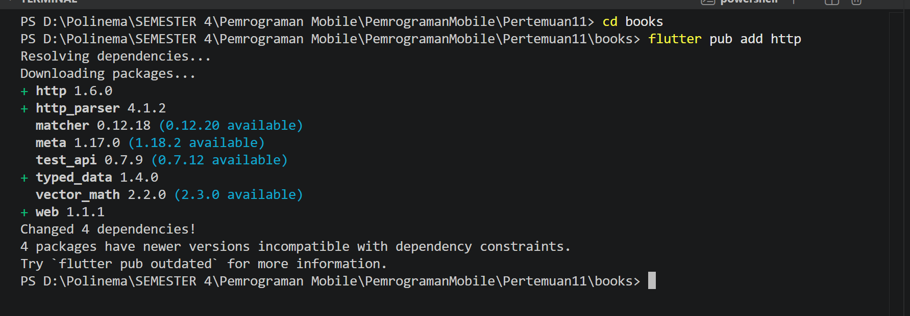

## Langkah 2: Cek file pubspec.yaml

Jika berhasil install plugin, pastikan plugin http telah ada di file pubspec ini seperti berikut.

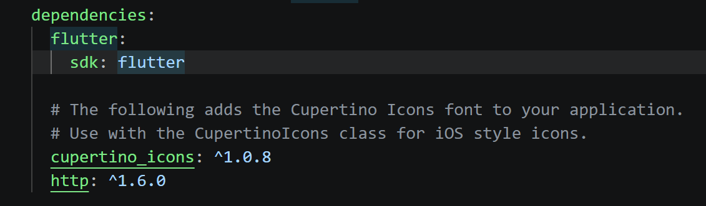

## Langkah 3: Buka file main.dart

```
import 'dart:async';
import 'package:flutter/material.dart';
import 'package:http/http.dart';
import 'package:http/http.dart' as http;

void main() {
  runApp(const MyApp());
}

class MyApp extends StatelessWidget {
  const MyApp({super.key});

  @override
  Widget build(BuildContext context) {
    return MaterialApp(
      title: 'Future Demo - Waely',
      theme: ThemeData(
        primarySwatch: Colors.blue,
        visualDensity: VisualDensity.adaptivePlatformDensity,
      ),
      home: const FuturePage(),
    );
  }
}

class FuturePage extends StatefulWidget {
  const FuturePage({super.key});

  @override
  State<FuturePage> createState() => _FuturePageState();
}
  @override
  Widget build(BuildContext context) {
    return Scaffold(
      appBar: AppBar(title: const Text('Back from the Future - Waely')),
      body: Center(
        child: Column(
          children: [
            const Spacer(),
            ElevatedButton(
              child: const Text('GO!'),
              onPressed: () {
                getData()
                    .then((value) {
                      setState(() {
                        result = value.body.toString().substring(0, 450);
                      });
                    })
                    .catchError((error) {
                      setState(() {
                        result = 'An error occurred';
                      });
                    });
              },
            ),

            const Spacer(),
            Text(result),
            const Spacer(),
            const CircularProgressIndicator(),
            const Spacer(),
          ],
        ),
      ),
    );
  }
}

```

### Soal 1 Tambahkan nama panggilan Anda pada title app sebagai identitas hasil pekerjaan Anda.

```
 title: 'Future Demo - Waely',
```

```
appBar: AppBar(title: const Text('Back from the Future - Waely')),
```

## Langkah 4: Tambah method getData()

```
class _FuturePageState extends State<FuturePage> {
  String result = '';
  Future<Response> getData() async {
    const authority = 'www.googleapis.com';
    const path = '/books/v1/volumes/n3vng7gyGCYC';
    Uri url = Uri.https(authority, path);
    return http.get(url);
  }
```

### Soal 2

### Carilah judul buku favorit Anda di Google Books, lalu ganti ID buku pada variabel path di kode tersebut. Caranya ambil di URL browser Anda seperti gambar berikut ini.


#### Kemudian cobalah akses di browser URI tersebut dengan lengkap seperti ini. Jika menampilkan data JSON, maka Anda telah berhasil. Lakukan capture milik Anda dan tulis di README pada laporan praktikum. Lalu lakukan commit dengan pesan "W11: Soal 2".


## Langkah 5: Tambah kode di ElevatedButton

```
 ElevatedButton(
              child: const Text('GO!'),
              onPressed: () {
                getData()
                    .then((value) {
                      setState(() {
                        result = value.body.toString().substring(0, 450);
                      });
                    })
                    .catchError((error) {
                      setState(() {
                        result = 'An error occurred';
                      });
                    });
              },
            ),

```

### Soal 3

### Jelaskan maksud kode langkah 5 tersebut terkait substring dan catchError!

- **substring(0, 450)**

  Method substring(0, 450) digunakan untuk mengambil sebagian data dari sebuah string, yaitu mulai dari karakter pertama (indeks 0) hingga karakter ke-450. Dalam konteks kode ini, data yang diambil berasal dari hasil response API Google Books yang berformat JSON dan biasanya sangat panjang. Oleh karena itu, data tersebut dibatasi agar hanya sebagian saja yang ditampilkan di layar aplikasi. Tujuan penggunaan substring adalah untuk menyederhanakan tampilan agar tidak terlalu panjang.

- **catchError**

  catchError digunakan untuk menangani kesalahan (error) yang terjadi saat proses pengambilan data dari API. Pada kode ini, jika permintaan ke Google Books API gagal, misalnya karena koneksi internet bermasalah atau URL tidak valid, maka bagian catchError akan dijalankan. Fungsi ini mencegah aplikasi mengalami crash dan menggantinya dengan menampilkan pesan “An error occurred” pada layar. Dengan adanya catchError, aplikasi menjadi lebih aman dan tetap dapat berjalan dengan baik meskipun terjadi kegagalan dalam proses asynchronous

### Capture hasil praktikum Anda berupa GIF dan lampirkan di README. Lalu lakukan commit dengan pesan "W11: Soal 3".

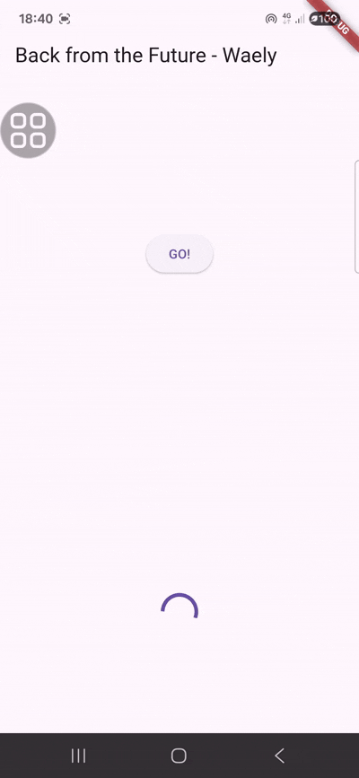

# Praktikum 2: Menggunakan await/async untuk menghindari callbacks

## Langkah 1: Buka file main.dart

```
  Future<int> returnOneAsync() async {
    await Future.delayed(const Duration(seconds: 3));
    return 1;
  }

  Future<int> returnTwoAsync() async {
    await Future.delayed(const Duration(seconds: 3));
    return 2;
  }

  Future<int> returnThreeAsync() async {
    await Future.delayed(const Duration(seconds: 3));
    return 3;
  }
```

## Langkah 2: Tambah method count()

```
  Future count() async {
    int total = 0;
    total = await returnOneAsync();
    total += await returnTwoAsync();
    total += await returnThreeAsync();
    setState(() {
      result = total.toString();
    });
  }
```

## Langkah 3: Panggil count()


## Langkah 4: Run

### Soal 4

### Jelaskan maksud kode langkah 1 dan 2 tersebut!

**Langkah1**

Pada langkah ini dibuat tiga method asynchronous:

- returnOneAsync() mengembalikan nilai 1 setelah delay 3 detik
- returnTwoAsync() mengembalikan nilai 2 setelah delay 3 detik
- returnThreeAsync() mengembalikan nilai 3 setelah delay 3 detik

  Ketiga method ini menggunakan Future.delayed, yang artinya proses akan ditunda selama waktu tertentu sebelum menghasilkan nilai.

**Langkah2**

Pada langkah ini dibuat method count() yang berfungsi untuk memanggil ketiga method sebelumnya secara berurutan menggunakan await, kemudian menjumlahkan hasilnya. Hasil dari setiap method disimpan dalam variabel total, lalu ditampilkan ke UI menggunakan setState().

#### Capture hasil praktikum Anda berupa GIF dan lampirkan di README. Lalu lakukan commit dengan pesan "W11: Soal 4".

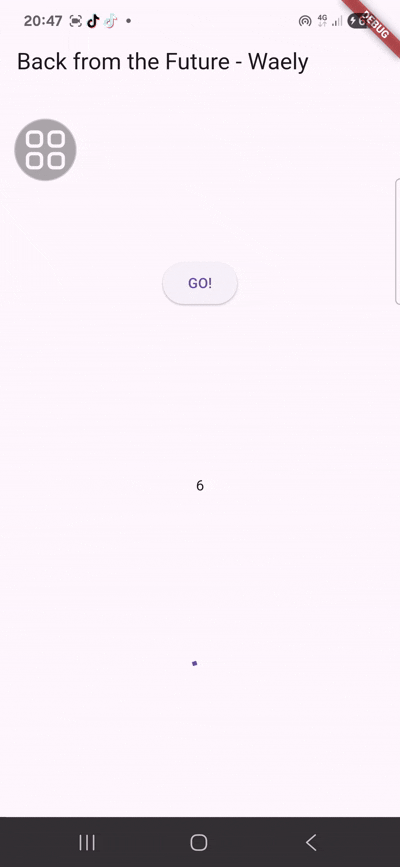

# Praktikum 3: Menggunakan Completer di Future

## Langkah 1: Buka main.dart


## Langkah 2: Tambahkan variabel dan method

```
  late Completer completer;

  Future getNumber() {
    completer = Completer<int>();
    calculate();
    return completer.future;
  }

  Future calculate() async {
    await Future.delayed(const Duration(seconds: 5));
    completer.complete(42);
  }
```

## Langkah 3: Ganti isi kode onPressed()


## Langkah 4 Run:

### Soal 5

### Jelaskan maksud kode langkah 2 tersebut!

Kode pada langkah 2 digunakan untuk membuat proses asynchronous menggunakan Completer. Variabel completer dipakai untuk membuat Future yang hasilnya bisa dikirim setelah proses selesai. Method getNumber() menjalankan method calculate() lalu mengembalikan Future dari completer.future. Di dalam calculate(), program menunggu selama 5 detik dengan Future.delayed, kemudian menjalankan completer.complete(42) untuk mengirim nilai 42. Jadi, saat getNumber() dipanggil, aplikasi akan menunggu 5 detik sebelum menampilkan angka 42.

### Capture hasil praktikum Anda berupa GIF dan lampirkan di README. Lalu lakukan commit dengan pesan "W11: Soal 5".

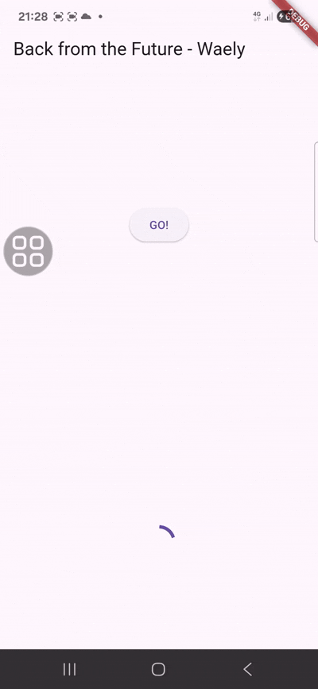

## Langkah 5: Ganti method calculate()

```
  Future calculate() async {
    try {
      await Future.delayed(const Duration(seconds: 5));

      completer.complete(42);

      // throw Exception();
    } catch (_) {
      completer.completeError({});
    }
  }

```

## Langkah 6: Pindah ke onPressed()

```
getNumber()
                    .then((value) {
                      setState(() {
                        result = value.toString();
                      });
                    })
                    .catchError((e) {
                      setState(() {
                        result = 'An error occurred';
                      });
                    });
              },
            ),

```

### Soal 6

### Jelaskan maksud perbedaan kode langkah 2 dengan langkah 5-6 tersebut!

Perbedaan langkah 2 dengan langkah 5 dan 6 ada pada cara menangani proses asynchronous dan error.

Pada langkah 2, Completer digunakan secara sederhana untuk membuat Future yang akan selesai setelah 5 detik dengan nilai 42. Proses ini hanya fokus pada kondisi berhasil saja, jadi kalau terjadi kesalahan tidak ada penanganannya.

Sedangkan pada langkah 5 dan 6, proses asynchronous dibuat lebih lengkap karena sudah ada penanganan error menggunakan try-catch di dalam method calculate(). Jadi, selain bisa mengembalikan hasil sukses dengan completer.complete(42), program juga bisa mengirim error menggunakan completer.completeError() jika terjadi masalah.

Di langkah 6 juga ditambahkan .then() untuk menangani hasil jika berhasil, dan .catchError() untuk menangani jika terjadi error saat memanggil getNumber().

### Capture hasil praktikum Anda berupa GIF dan lampirkan di README. Lalu lakukan commit dengan pesan "W11: Soal 6".


# Praktikum 4: Memanggil Future secara paralel

## Langkah 1: Buka file main.dart

```
void returnFG() {
    FutureGroup<int> futureGroup = FutureGroup<int>();
    futureGroup.add(returnOneAsync());
    futureGroup.add(returnTwoAsync());
    futureGroup.add(returnThreeAsync());
    futureGroup.close();

    futureGroup.future.then((List<int> value) {
      int total = 0;
      for (var element in value) {
        total += element;
      }
      setState(() {
        result = total.toString();
      });
    });
  }
```

## Langkah 2: Edit onPressed()


## Langkah 3: Run

### Soal 7

### Capture hasil praktikum Anda berupa GIF dan lampirkan di README. Lalu lakukan commit dengan pesan "W11: Soal 7".

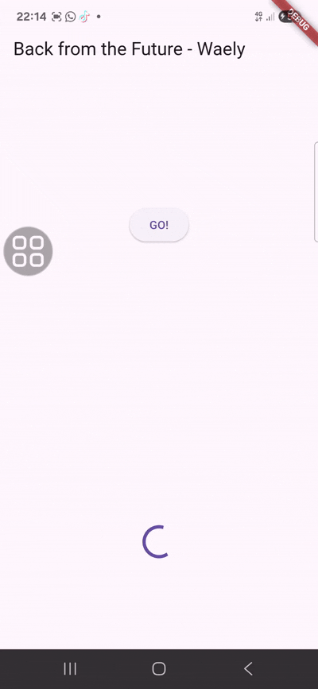

## Langkah 4: Ganti variabel futureGroup


### Soal 8

### Jelaskan maksud perbedaan kode langkah 1 dan 4!

Perbedaan langkah 1 dan langkah 4 ada pada cara menjalankan beberapa proses asynchronous secara bersamaan.

Pada langkah 1, digunakan FutureGroup. Di sini setiap Future ditambahkan satu per satu dengan add(), lalu harus ditutup dengan close() agar prosesnya bisa dijalankan. Setelah semua selesai, hasilnya akan berbentuk list.

Sedangkan pada langkah 4, FutureGroup diganti dengan Future.wait yang lebih sederhana. Kita cukup memasukkan beberapa Future ke dalam list, lalu Future.wait akan langsung menjalankan semuanya secara paralel tanpa perlu add() atau close().

# Praktikum 5: Menangani Respon Error pada Async Code

## Langkah 1: Buka file main.dart

```
Future returnError() async {
await Future.delayed(const Duration(seconds: 2));
throw Exception('Something terrible happened!');
}
```

## Langkah 2: ElevatedButton

```
ElevatedButton(
              child: const Text('GO!'),
              onPressed: () {
                returnError()
                    .then((value) {
                      setState(() {
                        result = 'Success';
                      });
                    })
                    .catchError((onError) {
                      setState(() {
                        result = onError.toString();
                      });
                    })
                    .whenComplete(() => print('Complete'));
```

## Langkah 3: Run

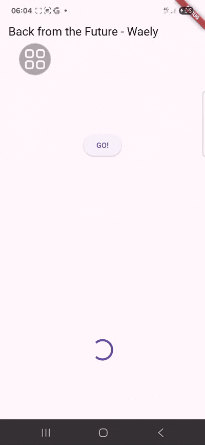

### Soal 9

### Capture hasil praktikum Anda berupa GIF dan lampirkan di README. Lalu lakukan commit dengan pesan "W11: Soal 9".

## Langkah 4: Tambah method handleError()

```
  Future handleError() async {
    try {
      await returnError();
    } catch (error) {
      setState(() {
        result = error.toString();
      });
    } finally {
      print('Complete');
    }
  }
```

### Soal 10

### Panggil method handleError() tersebut di ElevatedButton, lalu run. Apa hasilnya? Jelaskan perbedaan kode langkah 1 dan 4!

Pada langkah 1, dibuat method returnError() di dalam class \_FuturePageState. Method ini digunakan untuk menghasilkan proses asynchronous dengan delay 2 detik. Setelah itu, method ini menghasilkan error dengan throw Exception('Something terrible happened!') .

Sedangkan pada langkah 4, dibuat method handleError() yang berfungsi untuk menangani error dari returnError(). Di sini digunakan try-catch-finally.

- Pada bagian try, program mencoba menjalankan returnError().
- Kalau terjadi error, bagian catch akan menangkap error tersebut lalu menampilkannya ke variabel result menggunakan setState().
- Lalu bagian finally tetap dijalankan, yaitu menampilkan tulisan "Complete" di debug console, baik terjadi error maupun tidak.

Jadi, langkah 1 fokus untuk membuat error, sedangkan langkah 4 fokus untuk menangani error.

Output:


# Praktikum 6: Menggunakan Future dengan StatefulWidget

## Langkah 1: install plugin geolocator


## Langkah 2: Tambah permission GPS


## Langkah 3: Buat file geolocation.dart

Tambahkan file baru ini di folder lib project Anda.


## Langkah 4: Buat StatefulWidget

```
import 'package:flutter/material.dart';
import 'package:geolocator/geolocator.dart';

class LocationScreen extends StatefulWidget {
  const LocationScreen({super.key});

  @override
  State<LocationScreen> createState() => _LocationScreenState();
}

class _LocationScreenState extends State<LocationScreen> {
  String myPosition = '';

```

## Langkah 5: Isi kode geolocation.dart

```
import 'package:flutter/material.dart';
import 'package:geolocator/geolocator.dart';

class LocationScreen extends StatefulWidget {
  const LocationScreen({super.key});

  @override
  State<LocationScreen> createState() => _LocationScreenState();
}

class _LocationScreenState extends State<LocationScreen> {
  String myPosition = '';

  @override
  void initState() {
    super.initState();

    getPosition().then((Position myPos) {
      myPosition =
          'Latitude: ${myPos.latitude.toString()} - Longitude: ${myPos.longitude.toString()}';

      setState(() {
        myPosition = myPosition;
      });
    });
  }

  @override
  Widget build(BuildContext context) {
    final myWidget = myPosition == ""
        ? const CircularProgressIndicator()
        : Text(myPosition);

    return Scaffold(
      appBar: AppBar(title: const Text('Current Location - Waely')),
      body: Center(child: myWidget),
    );
  }

  Future<Position> getPosition() async {
    await Geolocator.requestPermission();
    await Geolocator.isLocationServiceEnabled();
    Position position = await Geolocator.getCurrentPosition();
    return position;
  }
}

```

### Soal 11

### Tambahkan nama panggilan Anda pada tiap properti title sebagai identitas pekerjaan Anda.

```
appBar: AppBar(title: const Text('Current Location - Waely')),
```

## Langkah 6: Edit main.dart

Panggil screen baru tersebut di file main Anda seperti berikut.

```
  @override
  Widget build(BuildContext context) {
    return MaterialApp(
      title: 'Future Demo - Waely',
      theme: ThemeData(
        primarySwatch: Colors.blue,
        visualDensity: VisualDensity.adaptivePlatformDensity,
      ),
      home: LocationScreen(),
    );
  }
}
```

## Langkah 7: Run

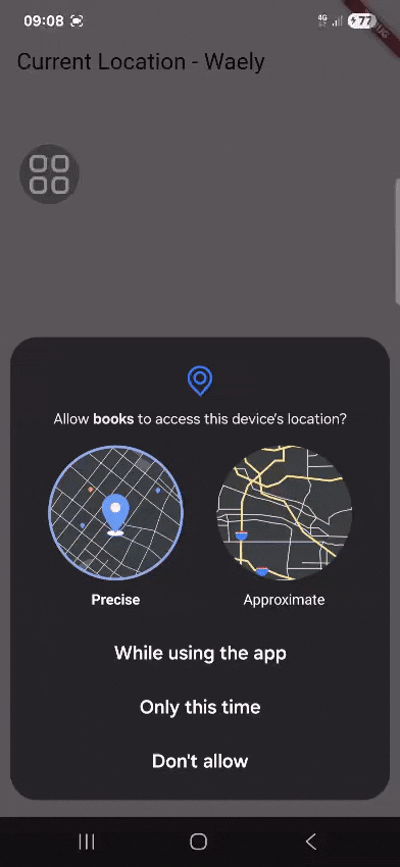

## Langkah 8: Tambahkan animasi loading

```
  @override
  Widget build(BuildContext context) {
    final myWidget = myPosition == ""
        ? const CircularProgressIndicator()
        : Text(myPosition);

    return Scaffold(
      appBar: AppBar(title: const Text('Current Location - Waely')),
      body: Center(child: myWidget),
    );
  }
```

Output

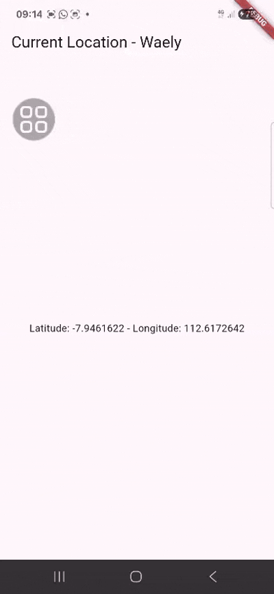

### Soal 12

### Jika Anda tidak melihat animasi loading tampil, kemungkinan itu berjalan sangat cepat. Tambahkan delay pada method getPosition() dengan kode await Future.delayed(const Duration(seconds: 3));

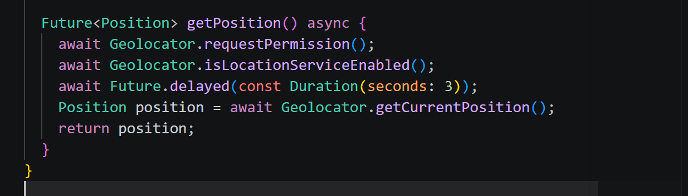

### Apakah Anda mendapatkan koordinat GPS ketika run di browser? Mengapa demikian?

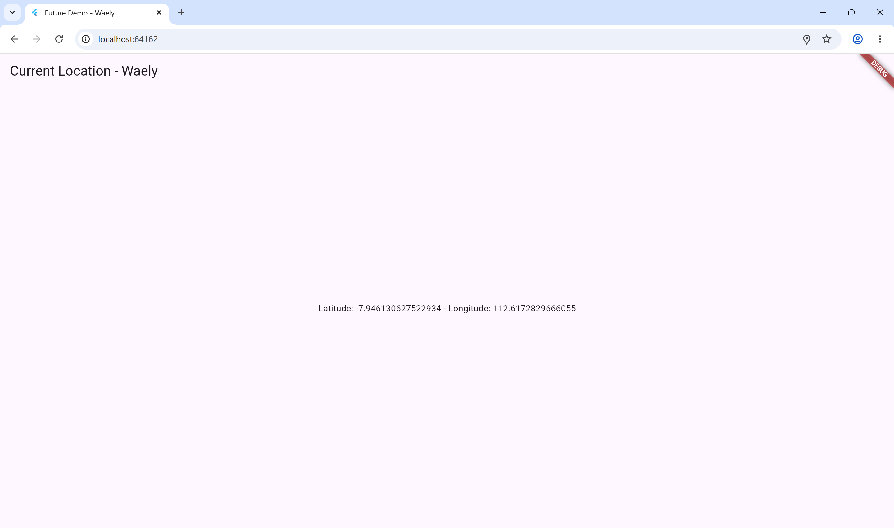

Ya, saat aplikasi Flutter dijalankan di browser seperti Chrome, koordinat GPS tetap bisa didapatkan. Ini karena browser punya fitur Geolocation API.
Fitur ini memungkinkan browser untuk mengetahui lokasi perangkat, bisa dari GPS atau jaringan internet yang sedang digunakan. Tapi, lokasi hanya bisa didapat kalau pengguna mengizinkan akses lokasi terlebih dahulu. Jika sudah diizinkan, Chrome akan mengirimkan data lokasi itu ke aplikasi Flutter melalui plugin geolocator. Jadi, walaupun dijalankan di browser, latitude dan longitude tetap bisa muncul karena browser memang sudah menyediakan fitur untuk mengambil lokasi.

### Capture hasil praktikum Anda berupa GIF dan lampirkan di README. Lalu lakukan commit dengan pesan "W11: Soal 12".


# Praktikum 7: Manajemen Future dengan FutureBuilder

## Langkah 1: Modifikasi method getPosition()

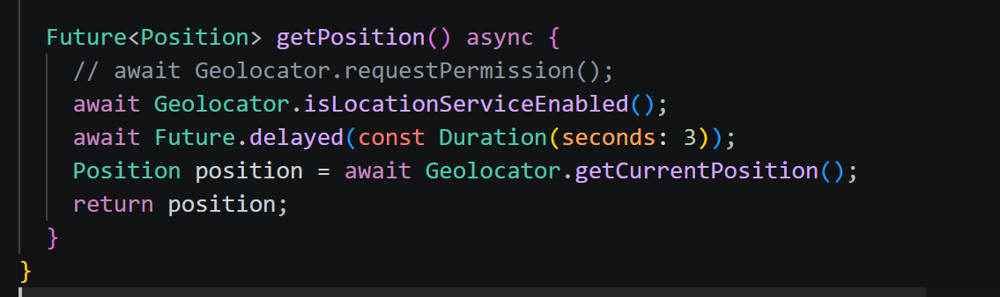

## Langkah 2: Tambah variabel

```
class _LocationScreenState extends State<LocationScreen> {
  String myPosition = '';
  Future<Position>? position;
```

## Langkah 3: Tambah initState()

```
  @override
  void initState() {
    super.initState();
    position = getPosition();
```

## Langkah 4: Edit method build()

```
 @override
  Widget build(BuildContext context) {
    return Scaffold(
      appBar: AppBar(title: Text('Current Location - Waely')),
      body: Center(
        child: FutureBuilder(
          future: position,
          builder: (BuildContext context, AsyncSnapshot<Position> snapshot) {
            if (snapshot.connectionState == ConnectionState.waiting) {
              return const CircularProgressIndicator();
            } else if (snapshot.connectionState == ConnectionState.done) {
              if (snapshot.hasError) {
                return Text('Something terrible happened!');
              }
              return Text(snapshot.data.toString());
            } else {
              return const Text('');
            }
          },
        ),
      ),
    );
  }

```

### Soal 13

### Apakah ada perbedaan UI dengan praktikum sebelumnya? Mengapa demikian?

Iya terdapt perbedaan antara praktikum 6 dan 7

Pada praktikum 6, UI masih diatur secara manual menggunakan setState(). Jadi, semua proses seperti mengambil data GPS, loading, dan mengubah tampilan harus dibuat sendiri.

Sedangkan pada praktikum 7, sudah menggunakan FutureBuilder. Dengan ini, proses asynchronous dan tampilan UI sudah terhubung otomatis. FutureBuilder langsung menangani kondisi loading, data selesai, atau error tanpa perlu setState() lagi. Hasilnya, kode jadi lebih rapi dibanding praktikum sebelumnya.

### Capture hasil praktikum Anda berupa GIF dan lampirkan di README. Lalu lakukan commit dengan pesan "W11: Soal 13".

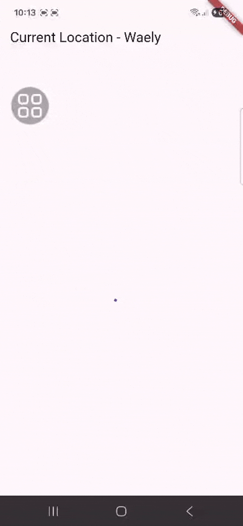

### Seperti yang Anda lihat, menggunakan FutureBuilder lebih efisien, clean, dan reactive dengan Future bersama UI.

## Langkah 5: Tambah handling error

```
child: FutureBuilder(
          future: position,
          builder: (BuildContext context, AsyncSnapshot<Position> snapshot) {
            if (snapshot.connectionState == ConnectionState.waiting) {
              return const CircularProgressIndicator();
            } else if (snapshot.connectionState == ConnectionState.done) {
              if (snapshot.hasError) {
                return Text('Something terrible happened!');
              }
              return Text(snapshot.data.toString());
```

### Soal 14

### Apakah ada perbedaan UI dengan langkah sebelumnya? Mengapa demikian?

Ya, secara tampilan UI hampir tidak ada perbedaan dengan langkah sebelumnya karena komponen yang ditampilkan masih sama, seperti loading indicator dan teks hasil lokasi.

Perbedaannya ada pada penanganan error di dalam FutureBuilder. Sebelumnya, aplikasi hanya menangani kondisi loading dan data berhasil. Jadi, kalau terjadi error tampilan bisa kosong.

Setelah ditambahkan snapshot.hasError, aplikasi bisa menampilkan pesan error seperti “Something terrible happened!” saat proses pengambilan lokasi gagal. Jadi, perubahan utamanya ada pada logika penanganan error, bukan pada tampilan UI.

### Capture hasil praktikum Anda berupa GIF dan lampirkan di README. Lalu lakukan commit dengan pesan "W11: Soal 14".

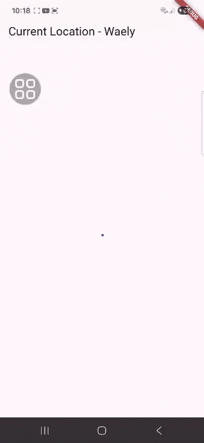

# Praktikum 8: Navigation route dengan Future Function

## Langkah 1: Buat file baru navigation_first.dart

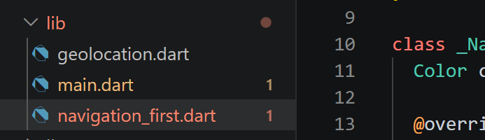

## Langkah 2: Isi kode navigation_first.dart

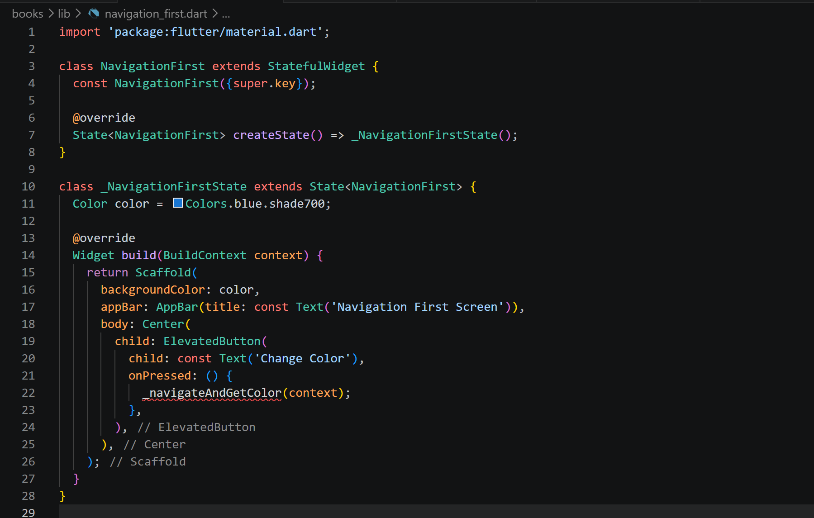

### Soal 15

### Tambahkan nama panggilan Anda pada tiap properti title sebagai identitas pekerjaan Anda.

```
 backgroundColor: color,
      appBar: AppBar(title: const Text('Navigation First Screen - Waely')),
      body: Center(
```

### Silakan ganti dengan warna tema favorit Anda.

```
class _NavigationFirstState extends State<NavigationFirst> {
  Color color = const Color.fromARGB(255, 149, 117, 205);
```

## Langkah 3: Tambah method di class \_NavigationFirstState

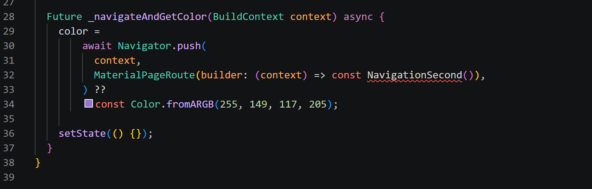

## Langkah 4: Buat file baru navigation_second.dart

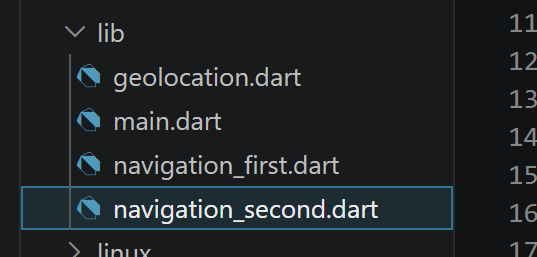

## Langkah 5: Buat class NavigationSecond dengan StatefulWidget

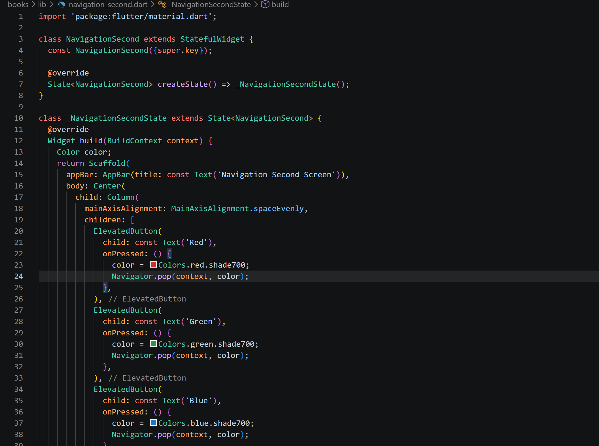

Output

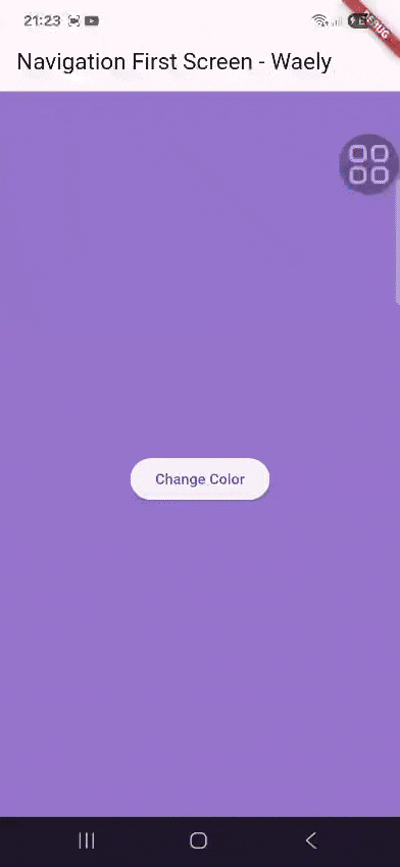

## Langkah 6: Edit main.dart


## Langkah 8: Run

### Soal 16

### Cobalah klik setiap button, apa yang terjadi ? Mengapa demikian ?

Saat setiap button diklik, aplikasi akan kembali ke halaman Navigation First dan warna background akan berubah sesuai warna yang dipilih di Navigation Second. Ini terjadi karena button di NavigationSecond menggunakan Navigator.pop(context, color) untuk mengirim warna ke halaman sebelumnya. Warna tersebut diterima di NavigationFirst, lalu disimpan ke variabel color dan diperbarui dengan setState(). Jadi, tampilan halaman pertama langsung berubah sesuai warna yang dipilih.

### Gantilah 3 warna pada langkah 5 dengan warna favorit Anda!

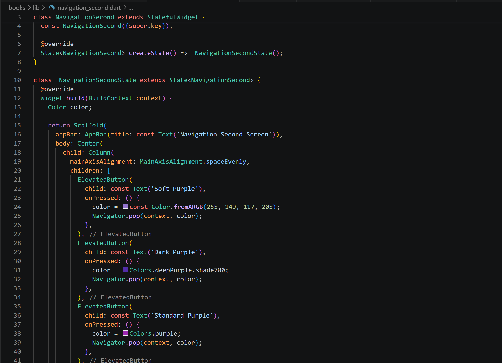

### Capture hasil praktikum Anda berupa GIF dan lampirkan di README. Lalu lakukan commit dengan pesan "W11: Soal 16".

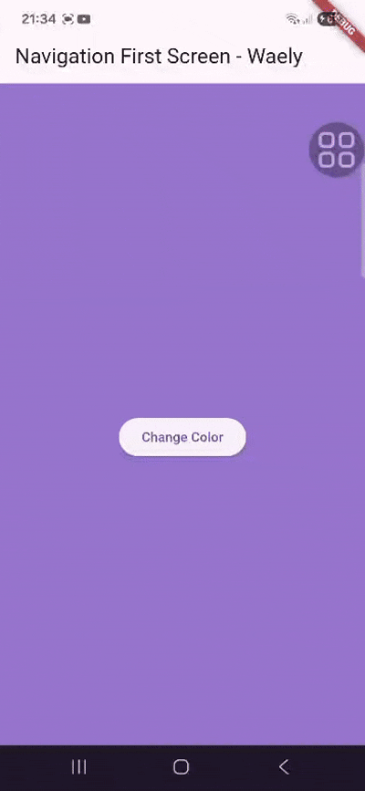

# Praktikum 9: Memanfaatkan async/await dengan Widget Dialog

## Langkah 1: Buat file baru navigation_dialog.dart

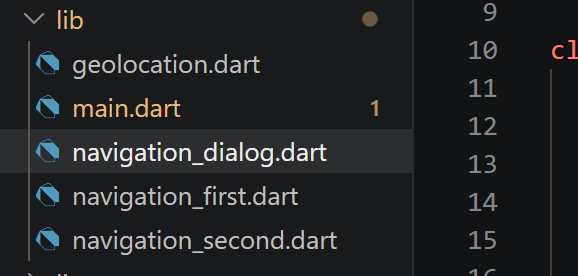

## Langkah 2: Isi kode navigation_dialog.dart

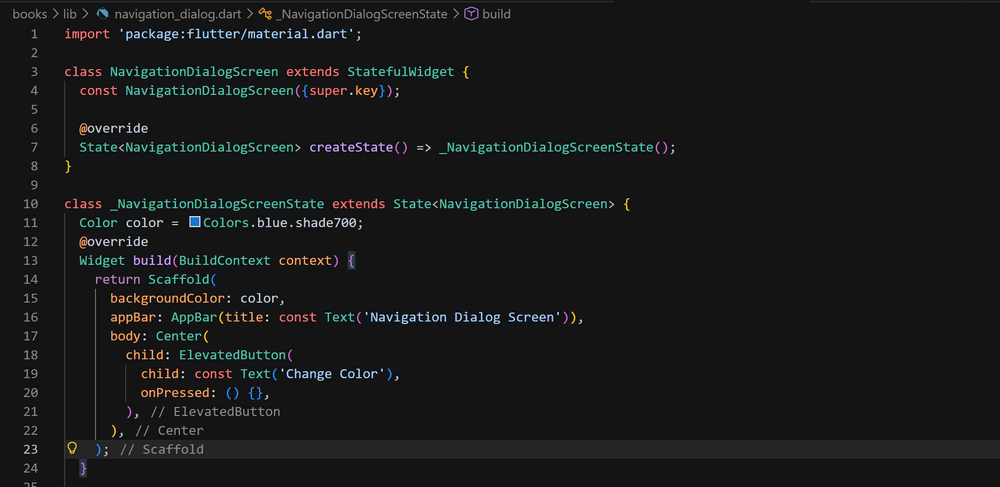

## Langkah 3: Tambah method async

```
 _showColorDialog(BuildContext context) async {
    await showDialog(
      barrierDismissible: false,
      context: context,
      builder: (_) {
        return AlertDialog(
          title: const Text('Very important question'),
          content: const Text('Please choose a color'),
          actions: <Widget>[
            TextButton(
              child: const Text('Red'),
              onPressed: () {
                color = Colors.red.shade700;
                Navigator.pop(context, color);
              },
            ),
            TextButton(
              child: const Text('Green'),
              onPressed: () {
                color = Colors.green.shade700;
                Navigator.pop(context, color);
              },
            ),
            TextButton(
              child: const Text('Blue'),
              onPressed: () {
                color = Colors.blue.shade700;
                Navigator.pop(context, color);
              },
            ),
          ],
        );
      },
    );
    setState(() {});
```

## Langkah 4: Panggil method di ElevatedButton

```
 body: Center(
        child: ElevatedButton(
          child: const Text('Change Color'),
          onPressed: () {
            _showColorDialog(context);
          },
        ),
      ),
```

## Langkah 5: Edit main.dart

```
 ),
      home: const NavigationDialogScreen(),
    );
```

## Langkah 6: Run

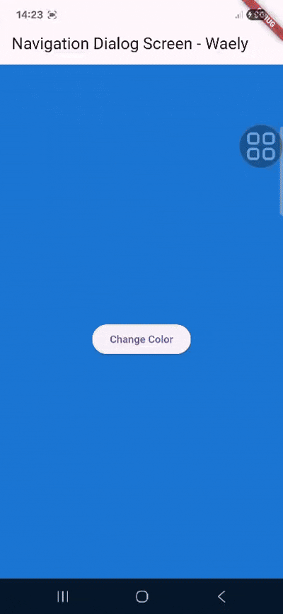

### Soal 17

### Cobalah klik setiap button, apa yang terjadi ? Mengapa demikian ?

Saat tombol Change Color ditekan, akan muncul dialog AlertDialog yang berisi beberapa pilihan warna. Setelah salah satu warna dipilih, dialog akan tertutup dan warna background halaman akan berubah sesuai pilihan. Hal ini terjadi karena setiap tombol di dialog menggunakan Navigator.pop(context, color) untuk mengirim warna ke halaman utama. Warna tersebut disimpan ke variabel color, lalu tampilan diperbarui dengan setState(). Jadi, warna background langsung berubah sesuai pilihan dari dialog.

### Gantilah 3 warna pada langkah 3 dengan warna favorit Anda!

```
 _showColorDialog(BuildContext context) async {
    await showDialog(
      barrierDismissible: false,
      context: context,
      builder: (_) {
        return AlertDialog(
          title: const Text('Very important question'),
          content: const Text('Please choose a color'),
          actions: <Widget>[
            TextButton(
              child: const Text('Pink'),
              onPressed: () {
                color = Colors.pink.shade300;
                Navigator.pop(context, color);
              },
            ),
            TextButton(
              child: const Text('Purple'),
              onPressed: () {
                color = Colors.purple.shade400;
                Navigator.pop(context, color);
              },
            ),
            TextButton(
              child: const Text('Sage'),
              onPressed: () {
                color = const Color.fromARGB(255, 188, 184, 138);
                Navigator.pop(context, color);
              },
            ),
          ],
        );
      },
    );
    setState(() {});
  }
```

### Capture hasil praktikum Anda berupa GIF dan lampirkan di README. Lalu lakukan commit dengan pesan "W11: Soal 17".

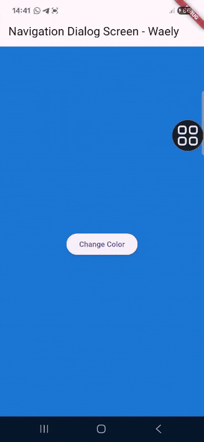
