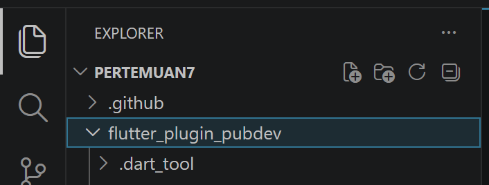
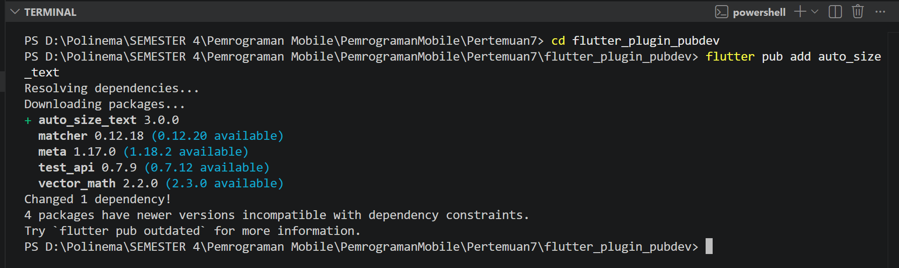
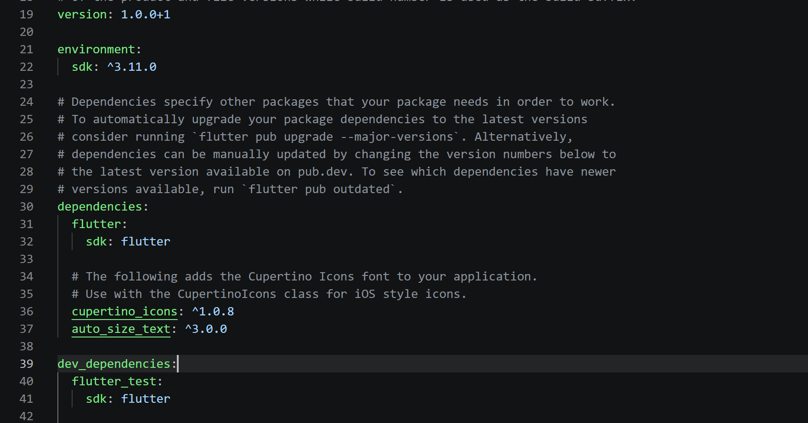
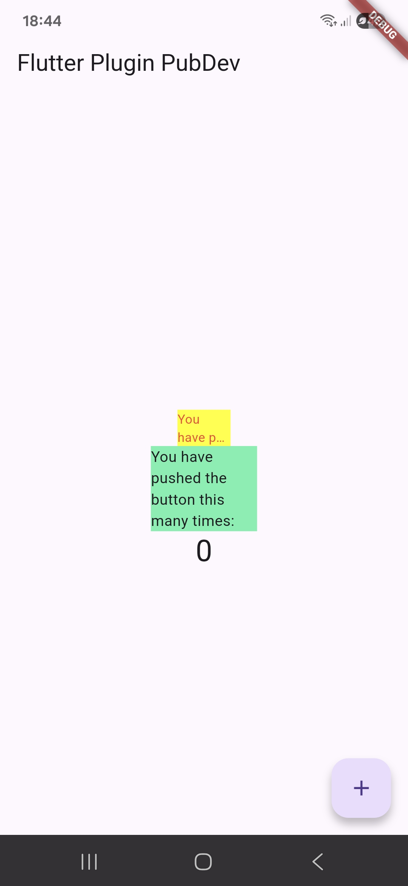

# Laporan Praktikum 07: Manajemen Plugin

Nama: Nur Waely Qistina

NIM: 244107060011

Kelas: SIB 2D

# Praktikum Menerapkan Plugin di Project Flutter

## Langkah 1: Buat Project Baru

Buatlah sebuah project flutter baru dengan nama flutter_plugin_pubdev. Lalu jadikan repository di GitHub Anda dengan nama flutter_plugin_pubdev.



## Langkah 2: Menambahkan Plugin

Tambahkan plugin auto_size_text menggunakan perintah berikut di terminal



Jika berhasil, maka akan tampil nama plugin beserta versinya di file pubspec.yaml pada bagian dependencies.



## Langkah 3: Buat file red_text_widget.dart

Buat file baru bernama red_text_widget.dart di dalam folder lib lalu isi kode seperti berikut.

```
import 'package:flutter/material.dart';

class RedTextWidget extends StatelessWidget {
const RedTextWidget({Key? key}) : super(key: key);

@override
Widget build(BuildContext context) {
return Container();
}
}
```

## Langkah 4: Tambah Widget AutoSizeText

Masih di file red_text_widget.dart, untuk menggunakan plugin auto_size_text, ubahlah kode return Container() menjadi seperti berikut.

```
import 'package:flutter/material.dart';

class RedTextWidget extends StatelessWidget {
  const RedTextWidget({Key? key}) : super(key: key);

  @override
  Widget build(BuildContext context) {
    return AutoSizeText(
      text,
      style: const TextStyle(color: Colors.red, fontSize: 14),
      maxLines: 2,
      overflow: TextOverflow.ellipsis,
    );
  }
}
```

Setelah Anda menambahkan kode di atas, Anda akan mendapatkan info error. Mengapa demikian? Jelaskan dalam laporan praktikum Anda!

#### Jawab: Setelah menambahkan AutoSizeText, muncul error karena package auto_size_text belum di-import sehingga class tidak dikenali oleh Flutter. Selain itu, variabel text juga belum dideklarasikan di dalam RedTextWidget, sehingga muncul error Undefined name 'text'. Solusinya adalah menambahkan import package dan mendeklarasikan text sebagai parameter widget.

## Langkah 5: Buat Variabel text dan parameter di constructor

Tambahkan variabel text dan parameter di constructor seperti berikut.

```
class RedTextWidget extends StatelessWidget {
  final String text;

  const RedTextWidget({Key? key, required this.text}) : super(key: key);
```

## Langkah 6: Tambahkan widget di main.dart

Buka file main.dart lalu tambahkan di dalam children: pada class \_MyHomePageState

```
Container(
              color: Colors.yellowAccent,
              width: 50,
              child: const RedTextWidget(
                text: 'You have pushed the button this many times:',
              ),
            ),
            Container(
              color: Colors.greenAccent,
              width: 100,
              child: const Text('You have pushed the button this many times:'),
            ),

```

Run aplikasi tersebut dengan tekan F5, maka hasilnya akan seperti berikut.


# Tugas Praktikum

### 1. Selesaikan Praktikum tersebut, lalu dokumentasikan dan push ke repository Anda berupa screenshot hasil pekerjaan beserta penjelasannya di file README.md!

### read_text_widget.dart

```
import 'package:flutter/material.dart';
import 'package:auto_size_text/auto_size_text.dart';

class RedTextWidget extends StatelessWidget {
final String text;

const RedTextWidget({Key? key, required this.text}) : super(key: key);

@override
Widget build(BuildContext context) {
return AutoSizeText(
text,
style: const TextStyle(color: Colors.red, fontSize: 14),
maxLines: 2,
overflow: TextOverflow.ellipsis,
);
}
}
```

### main.dart

```
import 'package:flutter/material.dart';
import 'package:flutter_plugin_pubdev/red_text_widget.dart';

void main() {
  runApp(const MyApp());
}

class MyApp extends StatelessWidget {
  const MyApp({super.key});

  @override
  Widget build(BuildContext context) {
    return MaterialApp(
      title: 'Flutter Plugin Demo',
      theme: ThemeData(primarySwatch: Colors.blue),
      home: const MyHomePage(title: 'Flutter Demo Home Page'),
    );
  }
}

class MyHomePage extends StatefulWidget {
  const MyHomePage({super.key, required this.title});

  final String title;

  @override
  State<MyHomePage> createState() => _MyHomePageState();
}

class _MyHomePageState extends State<MyHomePage> {
  int _counter = 0;

  void _incrementCounter() {
    setState(() {
      _counter++;
    });
  }

  @override
  Widget build(BuildContext context) {
    return Scaffold(
      appBar: AppBar(title: Text(widget.title)),
      body: Center(
        child: Column(
          mainAxisAlignment: MainAxisAlignment.center,
          children: <Widget>[
            Container(
              color: Colors.yellowAccent,
              width: 50,
              child: const RedTextWidget(
                text: 'You have pushed the button this many times:',
              ),
            ),
            Container(
              color: Colors.greenAccent,
              width: 100,
              child: const Text('You have pushed the button this many times:'),
            ),
            Text(
              '$_counter',
              style: Theme.of(context).textTheme.headlineMedium,
            ),
          ],
        ),
      ),
      floatingActionButton: FloatingActionButton(
        onPressed: _incrementCounter,
        tooltip: 'Increment',
        child: const Icon(Icons.add),
      ),
    );
  }
}

```

### Output


#### 2. Jelaskan maksud dari langkah 2 pada praktikum tersebut!

```
flutter pub add auto_size_text
```

Pada Langkah 2, command Flutter tersebut bertujuan untuk menambahkan plugin auto_size_text ke dalam project Flutter. Plugin ini digunakan agar teks yang ditampilkan dapat menyesuaikan ukuran secara otomatis.

### 3. Jelaskan maksud dari langkah 5 pada praktikum tersebut!

```
final String text;
const RedTextWidget({Key? key, required this.text}) : super(key: key);
```

Langkah ini bertujuan untuk menambahkan variabel text bertipe String sebagai tempat menyimpan teks yang akan ditampilkan pada widget RedTextWidget. Kata kunci final menunjukkan bahwa nilai text hanya dapat diisi satu kali saat widget dibuat dan tidak bisa diubah lagi. Parameter required this.text pada constructor digunakan agar nilai teks wajib diisi saat widget dipanggil.

### 4. Pada langkah 6 terdapat dua widget yang ditambahkan, jelaskan fungsi dan perbedaannya!

```
Container(
   color: Colors.yellowAccent,
   width: 50,
   child: const RedTextWidget(
             text: 'You have pushed the button this many times:',
          ),
),
Container(
    color: Colors.greenAccent,
    width: 100,
    child: const Text(
           'You have pushed the button this many times:',
          ),
),
```

Container pertama menggunakan RedTextWidget, yaitu widget kustom yang telah dibuat pada file sebelumnya. Fungsi widget ini adalah menampilkan teks dengan fitur tambahan, yaitu ukuran teks dapat menyesuaikan secara otomatis terhadap lebar container. Pada contoh ini, container memiliki lebar 50, sehingga ukuran teks akan menyesuaikan agar tetap muat di dalam area tersebut.

Container kedua menggunakan Text, yaitu widget bawaan Flutter untuk menampilkan teks biasa. Pada contoh ini, container memiliki lebar 100, sehingga teks ditampilkan secara standar tanpa penyesuaian ukuran otomatis.

Perbedaan keduanya adalah RedTextWidget merupakan widget kustom yang dapat menyesuaikan ukuran teks secara otomatis sesuai ukuran container, sedangkan Text adalah widget bawaan Flutter yang menampilkan teks biasa tanpa penyesuaian ukuran secara otomatis.

### 5. Jelaskan maksud dari tiap parameter yang ada di dalam plugin auto_size_text berdasarkan tautan pada dokumentasi ini !

Parameter-parameter pada plugin auto_size_text:

- text: Berisi teks yang akan ditampilkan pada widget.
- style: Digunakan untuk mengatur tampilan teks, seperti ukuran font, warna, jenis font dan lainnya.
- maxLines: Menentukan jumlah maksimal baris teks yang dapat ditampilkan.
- minFontSize: Menentukan ukuran huruf paling kecil yang diizinkan saat teks diperkecil secara otomatis.
- maxFontSize: Menentukan ukuran huruf terbesar yang boleh digunakan.
- stepGranularity: Menentukan besar pengurangan ukuran font pada setiap langkah penyesuaian.
- presetFontSizes: Digunakan untuk menentukan beberapa ukuran font tertentu yang boleh dipakai.
- group: Digunakan untuk mengelompokkan beberapa AutoSizeText agar memiliki ukuran font yang sama.
- textAlign: Mengatur posisi atau perataan teks, misalnya rata kiri, tengah, kanan, atau justify.
- textDirection: Menentukan arah penulisan teks, misalnya dari kiri ke kanan atau dari kanan ke kiri.
- overflow: Mengatur tampilan teks jika teks masih terlalu panjang dan tidak muat, misalnya dipotong atau ditampilkan dengan tanda titik tiga.
- softWrap: Menentukan apakah teks boleh pindah ke baris berikutnya secara otomatis ketika mencapai batas lebar container.

### 6. Kumpulkan laporan praktikum Anda berupa link repository GitHub kepada dosen!
