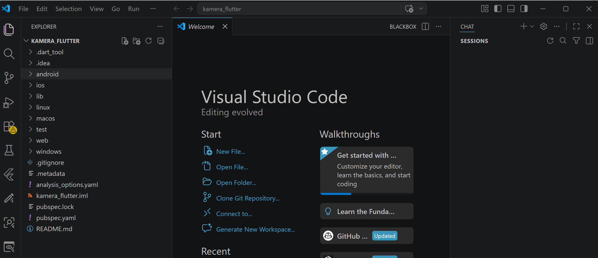
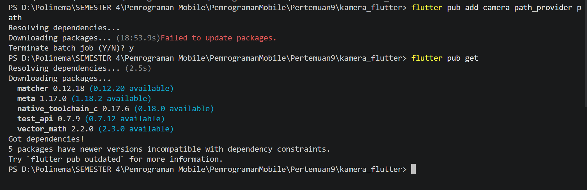
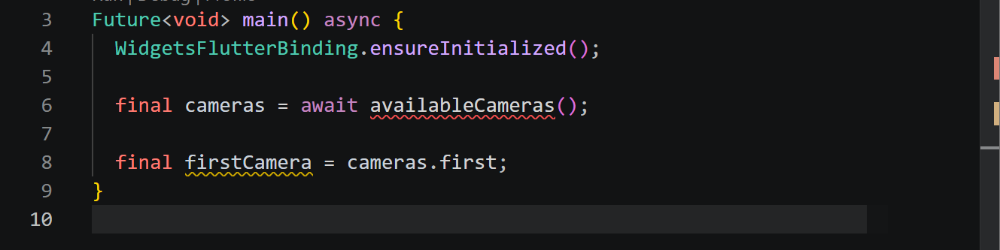
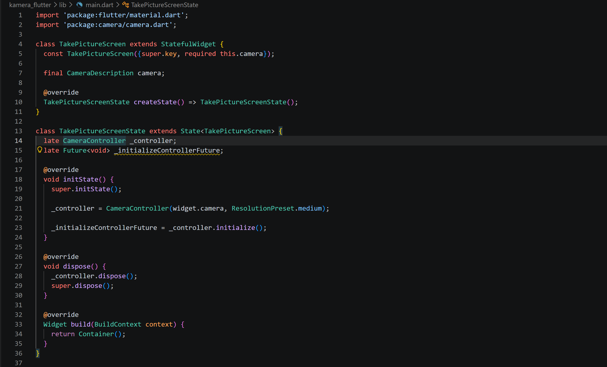
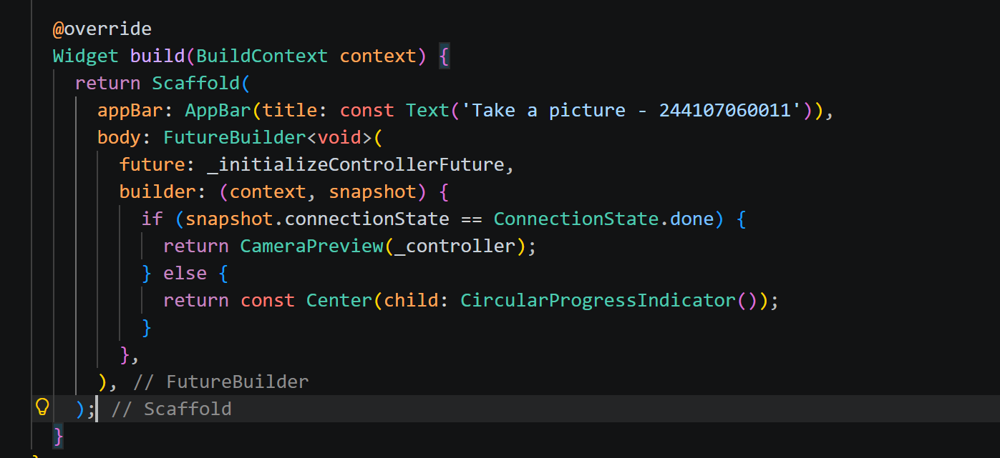
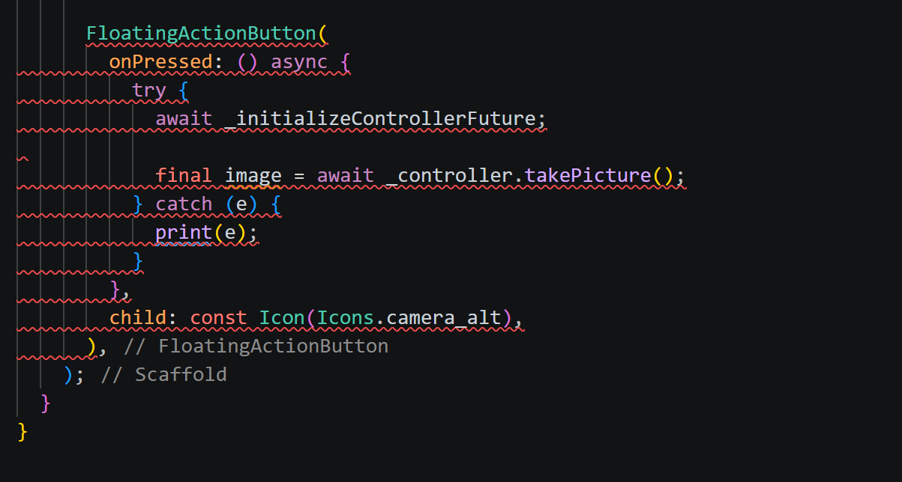
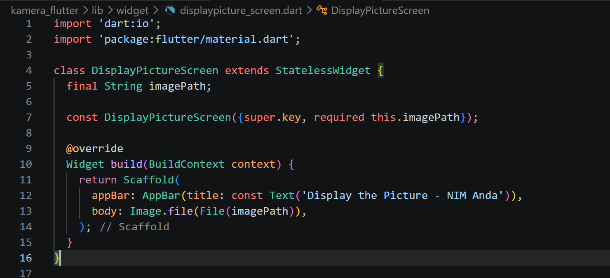
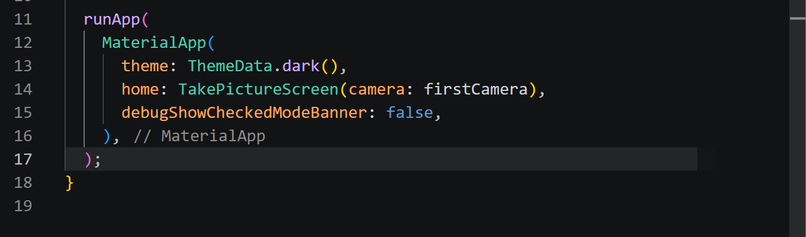
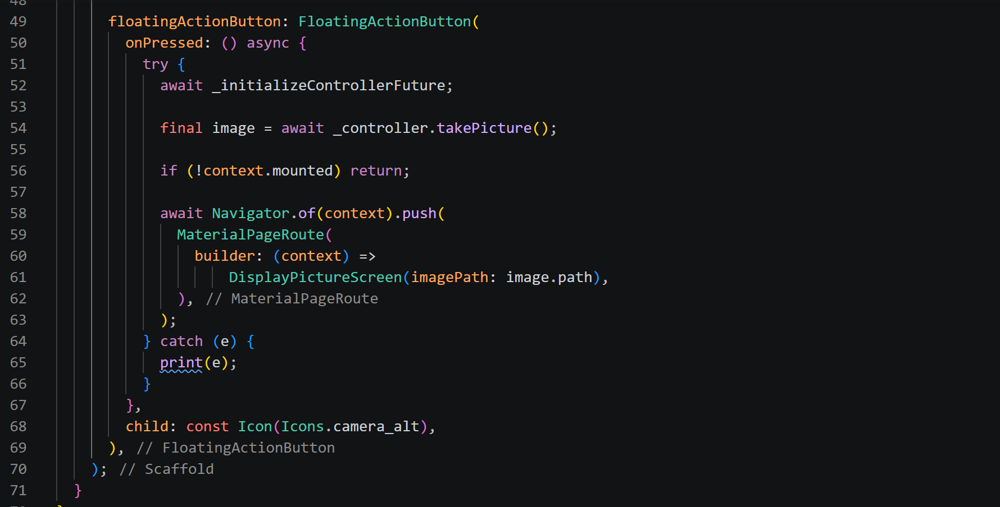
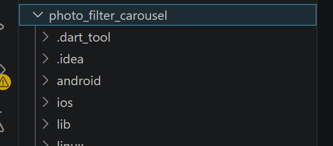

# Laporan Praktikum 07: Kamera

Nama: Nur Waely Qistina

NIM: 244107060011

Kelas: SIB 2D

# Praktikum 1: Mengambil Foto dengan Kamera di Flutter

## Langkah 1: Buat Project Baru

Buatlah sebuah project flutter baru dengan nama kamera_flutter, lalu sesuaikan style laporan praktikum yang Anda buat.



## Langkah 2: Tambah dependensi yang diperlukan



## Langkah 3: Ambil Sensor Kamera dari device

##### lib/main.dart

Ubah void main() menjadi async function seperti berikut ini.



## Langkah 4: Buat dan inisialisasi CameraController

#### lib/widget/takepicture_screen.dart



## Langkah 5: Gunakan CameraPreview untuk menampilkan preview foto

#### lib/widget/takepicture_screen.dart



## Langkah 6: Ambil foto dengan CameraController

#### lib/widget/takepicture_screen.dart



## Langkah 7: Buat widget baru DisplayPictureScreen

#### lib/widget/displaypicture_screen.dart



## Langkah 8: Edit main.dart

#### lib/main.dart



## Langkah 9: Menampilkan hasil foto

#### lib/widget/takepicture_screen.dart



## Output


# Praktikum 2: Membuat photo filter carousel

## Langkah 1: Buat project baru



## Langkah 2: Buat widget Selector ring dan dark gradient

#### lib/widget/filter_selector.dart

```
import 'package:flutter/material.dart';
import 'package:flutter/rendering.dart' show ViewportOffset;
import 'carousel_flowdelegate.dart';
import 'filter_item.dart';

@immutable
class FilterSelector extends StatefulWidget {
  const FilterSelector({
    super.key,
    required this.filters,
    required this.onFilterChanged,
    this.padding = const EdgeInsets.symmetric(vertical: 24),
  });

  final List<Color> filters;
  final void Function(Color selectedColor) onFilterChanged;
  final EdgeInsets padding;

  @override
  State<FilterSelector> createState() => _FilterSelectorState();
}

class _FilterSelectorState extends State<FilterSelector> {
  static const _filtersPerScreen = 5;
  static const _viewportFractionPerItem = 1.0 / _filtersPerScreen;

  late final PageController _controller;
  late int _page;

  int get filterCount => widget.filters.length;

  Color itemColor(int index) => widget.filters[index % filterCount];

  @override
  void initState() {
    super.initState();
    _page = 0;
    _controller = PageController(
      initialPage: _page,
      viewportFraction: _viewportFractionPerItem,
    );
    _controller.addListener(_onPageChanged);
  }

  void _onPageChanged() {
    final page = (_controller.page ?? 0).round();
    if (page != _page) {
      _page = page;
      widget.onFilterChanged(widget.filters[page]);
    }
  }

  void _onFilterTapped(int index) {
    _controller.animateToPage(
      index,
      duration: const Duration(milliseconds: 450),
      curve: Curves.ease,
    );
  }

  @override
  void dispose() {
    _controller.dispose();
    super.dispose();
  }

  @override
  Widget build(BuildContext context) {
    return Scrollable(
      controller: _controller,
      axisDirection: AxisDirection.right,
      physics: const PageScrollPhysics(),
      viewportBuilder: (context, viewportOffset) {
        return LayoutBuilder(
          builder: (context, constraints) {
            final itemSize = constraints.maxWidth * _viewportFractionPerItem;
            viewportOffset
              ..applyViewportDimension(constraints.maxWidth)
              ..applyContentDimensions(0.0, itemSize * (filterCount - 1));

            return Stack(
              alignment: Alignment.bottomCenter,
              children: [
                _buildShadowGradient(itemSize),
                _buildCarousel(
                  viewportOffset: viewportOffset,
                  itemSize: itemSize,
                ),
                _buildSelectionRing(itemSize),
              ],
            );
          },
        );
      },
    );
  }

  Widget _buildShadowGradient(double itemSize) {
    return SizedBox(
      height: itemSize * 2 + widget.padding.vertical,
      child: const DecoratedBox(
        decoration: BoxDecoration(
          gradient: LinearGradient(
            begin: Alignment.topCenter,
            end: Alignment.bottomCenter,
            colors: [Colors.transparent, Colors.black],
          ),
        ),
        child: SizedBox.expand(),
      ),
    );
  }

  Widget _buildCarousel({
    required ViewportOffset viewportOffset,
    required double itemSize,
  }) {
    return Container(
      height: itemSize,
      margin: widget.padding,
      child: Flow(
        delegate: CarouselFlowDelegate(
          viewportOffset: viewportOffset,
          filtersPerScreen: _filtersPerScreen,
        ),
        children: [
          for (int i = 0; i < filterCount; i++)
            FilterItem(
              onFilterSelected: () => _onFilterTapped(i),
              color: itemColor(i),
            ),
        ],
      ),
    );
  }

  Widget _buildSelectionRing(double itemSize) {
    return IgnorePointer(
      child: Padding(
        padding: widget.padding,
        child: SizedBox(
          width: itemSize,
          height: itemSize,
          child: const DecoratedBox(
            decoration: BoxDecoration(
              shape: BoxShape.circle,
              border: Border.fromBorderSide(
                BorderSide(width: 6, color: Colors.white),
              ),
            ),
          ),
        ),
      ),
    );
  }
}

```

## Langkah 3: Buat widget photo filter carousel

#### lib/widget/filter_carousel.dart

```
import 'package:flutter/material.dart';
import 'filter_selector.dart';

@immutable
class PhotoFilterCarousel extends StatefulWidget {
  const PhotoFilterCarousel({super.key});

  @override
  State<PhotoFilterCarousel> createState() => _PhotoFilterCarouselState();
}

class _PhotoFilterCarouselState extends State<PhotoFilterCarousel> {
  final _filters = [
    Colors.white,
    ...List.generate(
      Colors.primaries.length,
      (index) => Colors.primaries[(index * 4) % Colors.primaries.length],
    ),
  ];

  final _filterColor = ValueNotifier<Color>(Colors.white);

  void _onFilterChanged(Color value) {
    _filterColor.value = value;
  }

  @override
  Widget build(BuildContext context) {
    return Material(
      color: Colors.black,
      child: Stack(
        children: [
          Positioned.fill(child: _buildPhotoWithFilter()),
          Positioned(
            left: 0.0,
            right: 0.0,
            bottom: 0.0,
            child: _buildFilterSelector(),
          ),
        ],
      ),
    );
  }

  Widget _buildPhotoWithFilter() {
    return ValueListenableBuilder(
      valueListenable: _filterColor,
      builder: (context, color, child) {
        (
          'https://i.pinimg.com/736x/9a/97/e7/9a97e7df5e9d9100402e071720846b98.jpg',
          color: color.withOpacity(0.5),
          colorBlendMode: BlendMode.color,
          fit: BoxFit.cover,
        );
      },
    );
  }

  Widget _buildFilterSelector() {
    return FilterSelector(onFilterChanged: _onFilterChanged, filters: _filters);
  }
}

```

## Langkah 4: Membuat filter warna - bagian 1

#### lib/widget/carousel_flowdelegate.dart

```
import 'dart:math' as math;

import 'package:flutter/material.dart';
import 'package:flutter/rendering.dart' show ViewportOffset;

class CarouselFlowDelegate extends FlowDelegate {
  CarouselFlowDelegate({
    required this.viewportOffset,
    required this.filtersPerScreen,
  }) : super(repaint: viewportOffset);

  final ViewportOffset viewportOffset;
  final int filtersPerScreen;

  @override
  void paintChildren(FlowPaintingContext context) {
    final count = context.childCount;

    final size = context.size.width;

    final itemExtent = size / filtersPerScreen;

    final active = viewportOffset.pixels / itemExtent;

    final min = math.max(0, active.floor() - 3).toInt();

    final max = math.min(count - 1, active.ceil() + 3).toInt();

    for (var index = min; index <= max; index++) {
      final itemXFromCenter = itemExtent * index - viewportOffset.pixels;
      final percentFromCenter = 1.0 - (itemXFromCenter / (size / 2)).abs();
      final itemScale = 0.5 + (percentFromCenter * 0.5);
      final opacity = 0.25 + (percentFromCenter * 0.75);

      final itemTransform = Matrix4.identity()
        ..translate((size - itemExtent) / 2)
        ..translate(itemXFromCenter)
        ..translate(itemExtent / 2, itemExtent / 2)
        ..multiply(Matrix4.diagonal3Values(itemScale, itemScale, 1.0))
        ..translate(-itemExtent / 2, -itemExtent / 2);

      context.paintChild(index, transform: itemTransform, opacity: opacity);
    }
  }

  @override
  bool shouldRepaint(covariant CarouselFlowDelegate oldDelegate) {
    return oldDelegate.viewportOffset != viewportOffset;
  }
}

```

## Langkah 5: Membuat filter warna

#### lib/widget/filter_item.dart

```
import 'package:flutter/material.dart';

@immutable
class FilterItem extends StatelessWidget {
  const FilterItem({super.key, required this.color, this.onFilterSelected});

  final Color color;
  final VoidCallback? onFilterSelected;

  @override
  Widget build(BuildContext context) {
    return GestureDetector(
      onTap: onFilterSelected,
      child: AspectRatio(
        aspectRatio: 1.0,
        child: Padding(
          padding: const EdgeInsets.all(8),
          child: ClipOval(
            child: Image.network(
              'https://images.unsplash.com/photo-1557682250-33bd709cbe85?w=200&h=200&fit=crop',
              color: color.withOpacity(0.5),
              colorBlendMode: BlendMode.hardLight,
              loadingBuilder: (context, child, loadingProgress) {
                if (loadingProgress == null) return child;
                return Container(
                  color: Colors.grey[800],
                  child: const Center(
                    child: CircularProgressIndicator(
                      strokeWidth: 2,
                      color: Colors.white,
                    ),
                  ),
                );
              },
              errorBuilder: (context, error, stackTrace) {
                return Container(
                  color: color.withOpacity(0.3),
                  child: const Icon(
                    Icons.error_outline,
                    color: Colors.white,
                    size: 16,
                  ),
                );
              },
            ),
          ),
        ),
      ),
    );
  }
}

```

## Langkah 6: Implementasi filter carousel

#### lib/main.dart

```
import 'package:flutter/material.dart';
import 'widget/filter_carousel.dart';

void main() {
  runApp(
    const MaterialApp(
      home: PhotoFilterCarousel(),
      debugShowCheckedModeBanner: false,
    ),
  );
}

```

## Output


# Tugas Praktikum

#### 1. Selesaikan Praktikum 1 dan 2, lalu dokumentasikan dan push ke repository Anda berupa screenshot setiap hasil pekerjaan beserta penjelasannya di file README.md! Jika terdapat error atau kode yang tidak dapat berjalan, silakan Anda perbaiki sesuai tujuan aplikasi dibuat!

#### 2. Gabungkan hasil praktikum 1 dengan hasil praktikum 2 sehingga setelah melakukan pengambilan foto, dapat dibuat filter carouselnya!

##### Output


#### 3. Jelaskan maksud void async pada praktikum 1?

**Jawab:**

void async digunakan untuk mendeklarasikan sebuah fungsi yang tidak mengembalikan nilai, tetapi dapat menjalankan proses asynchronous. Kata kunci async memungkinkan fungsi tersebut menggunakan await, yaitu untuk menunggu proses yang membutuhkan waktu, seperti mengambil gambar dari kamera.

#### 4. Jelaskan fungsi dari anotasi @immutable dan @override ?

**Jawab:**

Anotasi **@immutable** digunakan untuk menandakan bahwa sebuah class tidak boleh diubah setelah objeknya dibuat, sehingga semua variabel di dalam class tersebut harus bersifat final dan nilainya tidak bisa diubah lagi setelah pertama kali diinisialisasi, tujuan utamanya adalah untuk mencegah perubahan data yang tidak disengaja.

Anotasi **@override** digunakan ketika sebuah method dalam suatu class menimpa (override) method yang berasal dari parent class, sehingga compiler mengetahui bahwa method tersebut memang dimaksudkan untuk menggantikan method dari class induk serta membantu mendeteksi kesalahan jika penulisan method tidak sesuai dengan yang ada di parent class.

#### 5. Kumpulkan link commit repository GitHub Anda kepada dosen yang telah disepakati!
